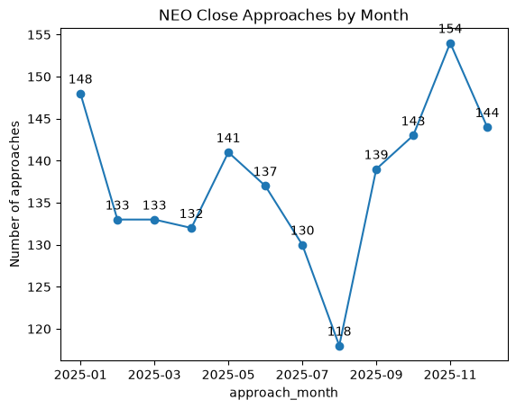

# NASA Near-Earth Object (NEO) Risk Analysis

End-to-end analysis of near-Earth asteroid close-approach data from NASA's
NeoWs API — covering data collection, cleaning, SQL analysis, and an
interactive Tableau dashboard.

## The Question
How often do near-Earth asteroids pass close to Earth, and what
characteristics make one "potentially hazardous"?

## Data Source
[NASA NeoWs API](https://api.nasa.gov/) — 1,652 close approaches tracked
across the full 2025 calendar year.

## Tools
Python (pandas, requests) · SQLite · SQL · Tableau Public

## Repo Structure
- `src/` — data collection, cleaning, and database loading scripts
- `sql/` — analysis queries
- `notebooks/` — exploratory analysis and chart generation
- `visuals/` — exported charts referenced below

## Key Findings
1. Close approaches occurred at a fairly steady pace throughout 2025 —
   roughly 110–150 per month — with a slight peak in November.
2. Asteroid size is a real predictor of hazard classification: about
   **41%** of large asteroids were classified as potentially hazardous,
   versus **3.5%** of medium and effectively **0%** of small ones.
3. The single closest approach of the year was **(2025 US6)**, passing
   within roughly **0.36 lunar distances** of Earth — and notably, this
   same object made 7 separate close approaches across the year, closer
   than any other tracked object by a wide margin.

## Interactive Dashboard
[View the live dashboard on Tableau Public](https://public.tableau.com/app/profile/aranza.marquez/viz/NasaNEORiskAnalysis/NEOsApproachRiskAnalysis2025)

## How to Reproduce
1. Clone the repo and run `pip install -r requirements.txt`
2. Get a free API key from api.nasa.gov and add it to `.env` (see `.env.example`)
3. Run `src/fetch_data.py`, then `src/clean_data.py`, then `src/load_to_sqlite.py`
4. Open `notebooks/eda_and_visuals.ipynb`

## Possible Extensions
- Build a simple predictive model on top of the size/hazard relationship
- Pull multiple years of data to check whether the seasonal pattern holds